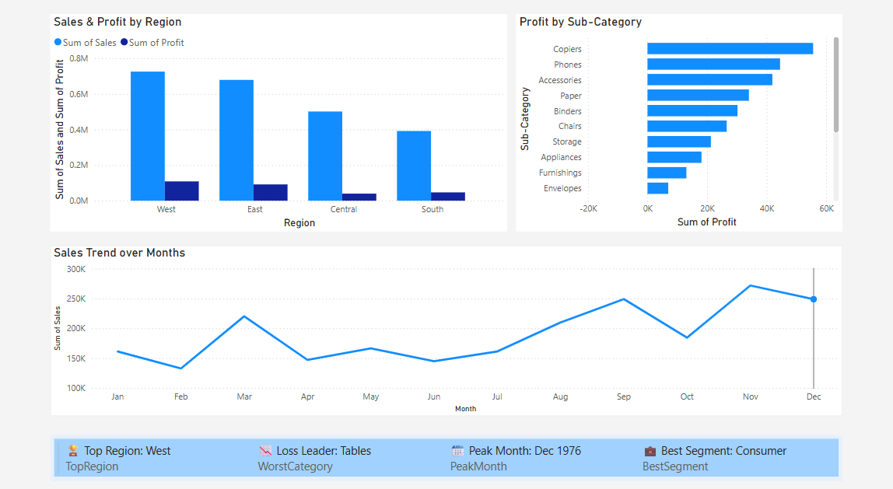

# 📊 Superstore Dashboard – Power BI
This project features a clean, one-page interactive dashboard built in **Power BI**, using the popular **Sample Superstore** dataset.

The dashboard uncovers key business insights through simple charts and dynamic KPI cards — all integrated into a single view.

---

## 📁 Project Files

- `Sample - Superstore.csv` – Source dataset  
- `Superstore Dashboard.pbix` – Power BI file with visuals and DAX  
- `dashboard_screenshot.png`- Screenshot of the Dashboard

---

## 🖼️ Dashboard Snapshot

Get a quick look at the final dashboard below. It highlights:

- Regional sales vs. profit performance  
- Product sub-categories by profitability  
- Monthly sales trend  
- 4 dynamic KPI cards for top region, loss category, peak month & best segment

 

---

✅ Built as part of a data storytelling task using Power BI.
